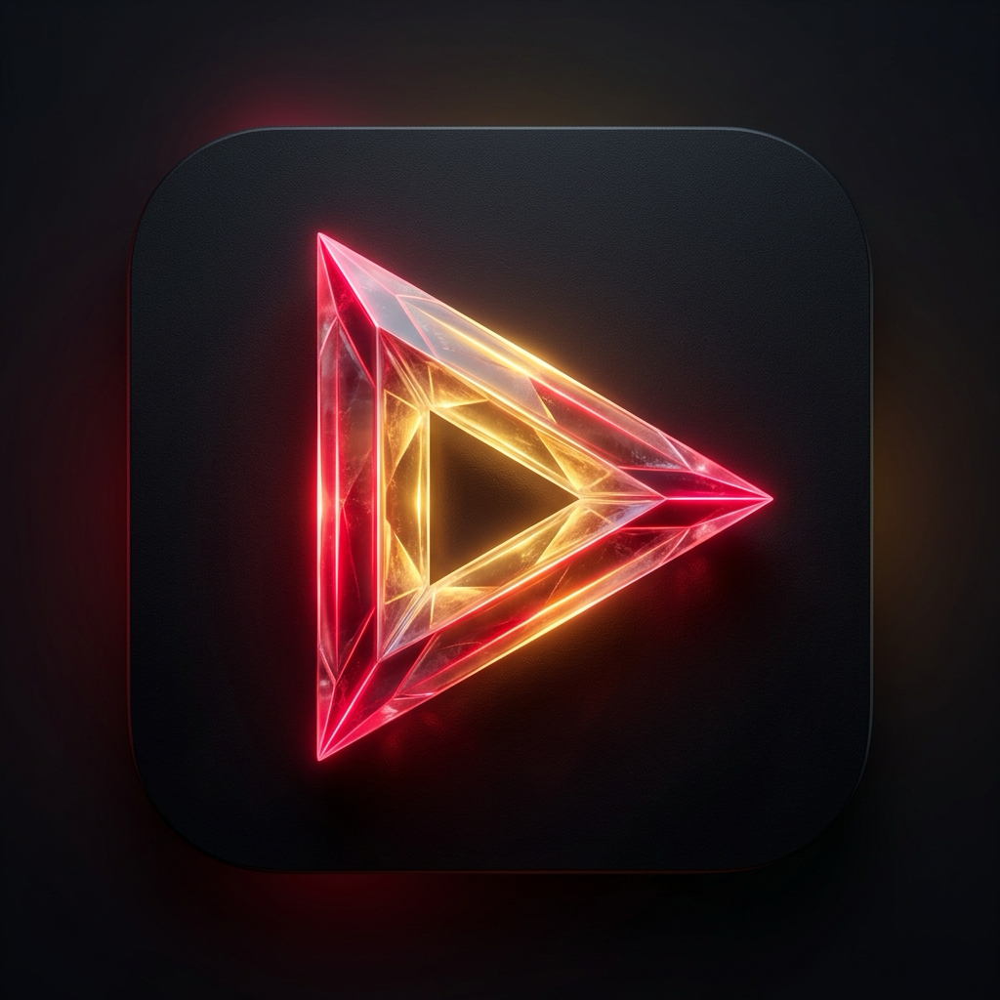

<br/>
<p align="center">
  <a href="https://github.com/vishnu32510/nungu_tv">
    
  </a>
  <h1 align="center">Nungu TV</h1>
</p>

<p align="center">
  <strong>Native Smart TV & Web Media Client for South Asian Cinema</strong><br>
  Optimized for 10-foot television remote controls, virtual mouse pointer, ad-free streaming, and 4K playback.
</p>

<p align="center">
  <a href="https://nungu-tv.web.app"></a>
  <a href="https://github.com/vishnu32510/nungu_tv/releases/latest"></a>
  <a href="https://github.com/vishnu32510/nungu_tv/actions"></a>
  <a href="https://flutter.dev"></a>
  <a href="#license"></a>
</p>

---

## 📥 Direct TV Downloads

| Platform | Package Format | Download Link | Instructions |
| :--- | :--- | :--- | :--- |
| **Android TV / TCL / Google TV / Fire TV** | `.apk` (Release) | [⬇ Download Android TV APK](https://github.com/vishnu32510/nungu_tv/releases/latest/download/NunguTV-AndroidTV-v1.0.0.apk) | [View Android TV Guide](#-android-tv--google-tv--firestick-installation) |
| **LG webOS Smart TV** | `.ipk` (Package) | [⬇ Download LG webOS IPK](https://github.com/vishnu32510/nungu_tv/releases/latest/download/NunguTV-webOS-v1.0.0.ipk) | [View LG webOS Guide](#-lg-webos-smart-tv-installation) |
| **Web & PWA** | Web App | [🌐 Open Nungu TV Web Hub](https://nungu-tv.web.app) | Top-level player launch (bypasses iframe restrictions) |

---

## ✨ Features

- **🎮 10-Foot Couch TV Experience**  
  Full D-Pad remote control integration with an on-screen **Virtual Air-Mouse cursor**. Point, click, and auto-scroll seamlessly on movie tiles and menus.
- **🛡️ Built-in Ad & Popunder Blocker**  
  Eliminates aggressive third-party ad networks (`popads`, `adsterra`, `propeller`, `vntsm`, etc.) and automatically closes discount / promo overlay modals.
- **⏱️ 10-Minute Limit Watchdog & Auto-Login**  
  Background watchdog automatically signs in with stored credentials (`.env`) to bypass guest preview restrictions and resume video playback.
- **📺 Hardware-Accelerated 4K & 1080p Playback**  
  Native media playback with hardware video decoding across Android TV and webOS viewports.
- **⚡ Slide-Down TV Menu Bar**  
  Quick access to Back, Forward, Reload, Tamil/Regional Home, Cursor/Scroll modes, and Zoom. Open using the remote's **Menu** button, pressing **`M`** on a keyboard, or moving the pointer to the top edge.
- **🌐 Responsive Web Hub**  
  Web portal serving 1-click player launches, language selectors (Tamil, Telugu, Hindi, Malayalam, Kannada, Bengali), and direct package downloads.

---

## 📺 Installation Guides

### 🤖 Android TV / Google TV / Firestick / TCL Installation

#### Method 1: Using the "Downloader" App (Recommended - No PC Needed)
1. On your TV, install **Downloader by AFTVnews** from the Google Play Store (or Amazon Appstore).
2. Allow Downloader to *Install Unknown Apps* in **Settings $\rightarrow$ Apps $\rightarrow$ Security & Restrictions**.
3. In the Downloader app URL bar, type:
   ```
   https://github.com/vishnu32510/nungu_tv/releases/latest/download/NunguTV-AndroidTV-v1.0.0.apk
   ```
4. Click **Install**.

#### Method 2: Via USB Drive
1. Download [`NunguTV-AndroidTV-v1.0.0.apk`](https://github.com/vishnu32510/nungu_tv/releases/latest/download/NunguTV-AndroidTV-v1.0.0.apk) to a USB flash drive.
2. Plug the USB drive into your TV and open any file manager (e.g. *File Commander*).
3. Click the `.apk` file to install.

#### Method 3: Wireless ADB (Mac / PC Terminal)
```bash
adb connect <YOUR_TV_IP>:5555
adb install -r dist/NunguTV-AndroidTV-v1.0.0.apk
```

---

### 📺 LG webOS Smart TV Installation

*Requires Developer Mode enabled on your LG TV.*

#### Method 1: Automated Script (Fastest for Mac)
1. Open the **Developer Mode** app on your LG TV, and enable **Dev Mode Status** and **Key Server**.
2. Note your TV's **IP Address** and 6-character **Passphrase**.
3. Run the installer script from your Mac terminal:
   ```bash
   ./scripts/install_to_lgtv.sh
   ```

#### Method 2: Device Manager for webOS (Desktop GUI)
1. Download **[Device Manager for webOS (Desktop)](https://github.com/webosbrew/dev-manager-desktop/releases)**.
2. Connect to your TV using the IP address and Dev Mode passphrase.
3. Drag and drop [`dist/NunguTV-webOS-v1.0.0.ipk`](https://github.com/vishnu32510/nungu_tv/releases/latest/download/NunguTV-webOS-v1.0.0.ipk) into the application list.

---

## 🛠️ Built With

* **[Flutter](https://flutter.dev/)** — Multi-platform UI toolkit
* **[webview_flutter](https://pub.dev/packages/webview_flutter)** — Native Android & iOS WebView rendering
* **[url_launcher](https://pub.dev/packages/url_launcher)** — Top-level external browsing handler
* **[flutter_dotenv](https://pub.dev/packages/flutter_dotenv)** — Environment credential configuration
* **[webOS ARES CLI](https://webostv.developer.lge.com/develop/tools/cli-introduction)** — LG webOS packaging & deployment
* **[Firebase Hosting](https://firebase.google.com/docs/hosting)** — Global CDN hosting for web application
* **[GitHub Actions](https://github.com/features/actions)** — Automated CI/CD pipelines for Web and Android APK builds

---

## 💻 Local Development Setup

### 1. Clone the Repository
```bash
git clone https://github.com/vishnu32510/nungu_tv.git
cd nungu_tv
```

### 2. Install Dependencies
```bash
flutter pub get
```

### 3. Setup Environment Variables
Create a `.env` file in the project root:
```env
EINTHUSAN_EMAIL=your_email@example.com
EINTHUSAN_PASSWORD=your_password
```

### 4. Run Locally
- **macOS Desktop**: `flutter run -d macos`
- **Web**: `flutter run -d chrome`
- **Android / TV Device**: `flutter run -d <device_id>`

---

## 🏗️ Build & Package Commands

```bash
# Android TV Release APK
flutter build apk --release

# Web Production Release
flutter build web --release --no-tree-shake-icons

# LG webOS IPK Package
npx -p @webosose/ares-cli ares-package webos -o ./dist
```

---

## 🔄 CI/CD Workflows

The repository includes GitHub Actions workflows in `.github/workflows/`:
- **`flutter_ci.yml`**: Static analysis (`flutter analyze`) and unit test validation on every push/PR.
- **`android_debug_apk.yml`**: Automated compilation and upload of the Android TV APK artifact.
- **`web_deploy_prod.yml`**: Automatic compilation and deployment of the Web Portal to Firebase Hosting upon merging to `main`.
- **`web_deploy_preview.yml`**: PR preview deployments on Firebase Hosting.

---

## ⚖️ Legal & DMCA Notice

Nungu TV is an independent third-party client and media browser. The software does not host, broadcast, archive, or store any copyrighted video streams on its own servers. All content is indexed and streamed directly from publicly accessible web servers.

- [Terms & Conditions](https://nungu-tv.web.app/terms.html)
- [DMCA & Copyright Takedown Policy](https://nungu-tv.web.app/terms.html#dmca)
- [Privacy Policy](https://nungu-tv.web.app/privacy.html)

---

## 👤 Author

* **Vishnu Priyan** - *Mobile & Multi-Platform Developer* - [@vishnu32510](https://github.com/vishnu32510)

## 📄 License

This project is licensed under the MIT License - see the [LICENSE](LICENSE) file for details.
